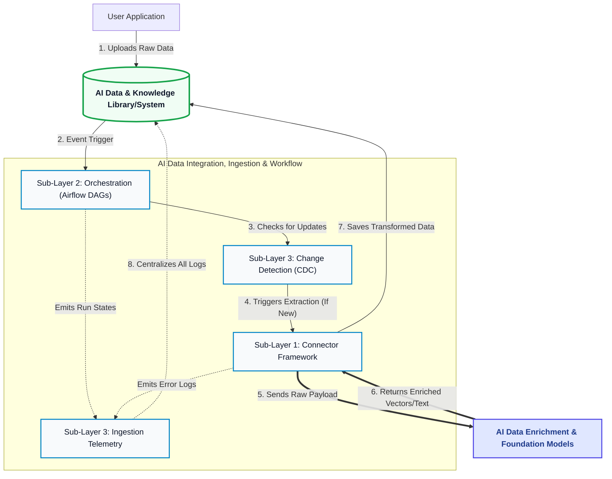

# AI Data Integration, Ingestion & Workflow

!!! abstract "Module Overview"
    This module serves as the central nervous system for data movement. It connects to internal and external sources to ingest data, utilizing **Apache Airflow** to orchestrate intelligent, event-driven, and scheduled pipelines. These pipelines reliably extract, transform, and route data for AI enrichment, predictive models, autonomous agents, and end-user applications.

### Sublayers

- [1.1 : Connector Framework](01-ai-ingestion-workflow/01-connector-framework.md)
- [1.2 : Ingestion Pipeline & Workflow Orchestration](01-ai-ingestion-workflow/02-data-ingestion-and-workflow.md)
- [1.3: Change Detection & Ingestion Telemetry](01-ai-ingestion-workflow/03-change-detection-telemetry.md)

## Integration Sources

The connector layer abstracts the complexity of securely authenticating and extracting data from a diverse set of origins, categorized into three main types:

### 1. Unstructured Data
* **PDF Documents:** Extracts text, tables, and metadata from static documents for downstream vectorization and semantic search.
* **HTTP/HTTPS (Web Scraping/Crawling):** Ingests raw HTML and web content from external sites and portals.

### 2. Structured Data
* **Azure SQL:** Pulls relational enterprise data, seamlessly integrating with the broader Azure ecosystem.
* **PostgreSQL:** Connects to robust, structured transactional databases.
* **SQLite:** Handles lightweight, local, or microservice-specific relational data stores.

### 3. REST API Based
* Subscribes to webhooks and actively polls external SaaS platforms, third-party services, and internal microservices via RESTful endpoints.

---
## Master Ingestion Architecture

The following diagram illustrates the complete, end-to-end lifecycle of data as it passes through all three sub-layers of the integration and ingestion framework:

---

## Ingestion & Orchestration (Apache Airflow)

Data flow is strictly managed and orchestrated using **Apache Airflow**.

* **DAG-Based Orchestration:** All pipelines are defined as Directed Acyclic Graphs (DAGs) in Python, allowing for clear dependency mapping, parallel execution, and complex workflow logic.
* **Batch Ingestion:** Scheduled Airflow jobs handle large-scale historical data syncs, bulk updates, and routine ETL processes.
* **Event-Driven Triggers:** Sensors within Airflow monitor for specific events (e.g., a new PDF landing in a storage bucket or a REST webhook payload), triggering ingestion DAGs dynamically to ensure low-latency responsiveness.

!!! tip "Pipeline Reliability & Monitoring"
    Airflow provides built-in state management. All orchestrated workflows are designed to be idempotent—if a task fails, Airflow's automated retries will safely re-run the extraction or transformation without duplicating data downstream.

---
