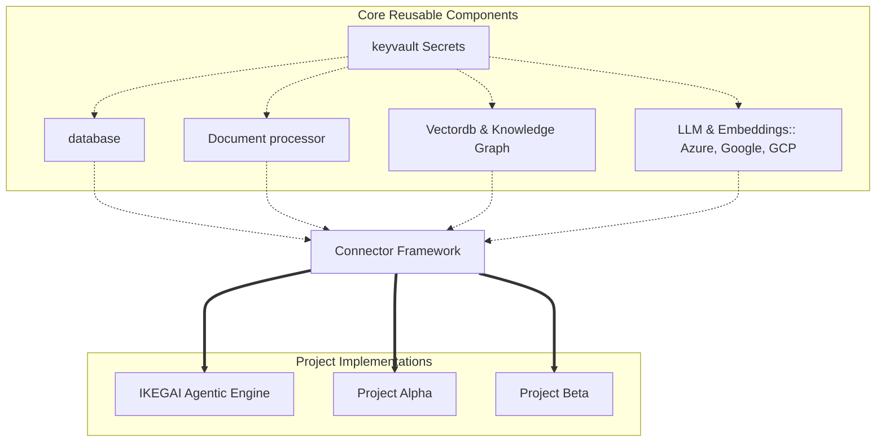

# 1.1 Connector Framework

!!! abstract "Framework Overview"
    The Connector Framework provides a standardized, **highly reusable** architecture to securely integrate with any data source. Designed as a collection of modular, plug-and-play components, these modules can be shared and utilized across multiple enterprise projects without having to rewrite core extraction, processing, or authentication logic.

## Architectural Modules

The framework is organized into independent Python packages, ensuring strict separation of concerns between extraction, document processing, and AI instantiation.

### 1. Authentication & Security Management (`keyvault`)
Secure connection handling is the backbone of the framework. 

- **Managed Identities:** Utilizes Azure Key Vault (via `keyvault`) to securely fetch connection strings, API tokens, and database credentials at runtime.
  

### 2. Structured Data Connectors (`database/`)
Handles direct, stateful connections to relational systems (e.g., Azure SQL, PostgreSQL).

- Standardized **CRUD** operations and connection pooling to prevent database exhaustion during high-volume batch ingestions.

### 3. Unstructured Document Processing (`doc_processors/`)
Dedicated to handling complex, raw files before they reach the AI orchestration layers. This module abstracts the underlying parsing engines:

- **Docling:** Utilized for robust, open-source document parsing, layout analysis, and structuring.

- **Azure Document Intelligence:** Integrated for enterprise-grade OCR, complex table extraction, and deep document understanding.

### 4. Vector & LLM Drivers (`embeddings/`, `vectordb/`, `llm/`)
Once data is processed, it interfaces with agnostic driver modules designed to instantiate AI resources dynamically:
- **LLM Engine (`llm/`):** Acts as a universal driver factory for creating LLM objects. It abstracts the provider APIs, allowing seamless switching and instantiation of models from  

- **Azure, Google, AWS, and Groq** depending on the specific project's cost or latency requirements.

- **Embeddings & Vector DB:** Transforms processed text into vector representations and manages the initialization for vector stores (e.g., Chroma DB).

---

# Supported Integrations

The framework abstracts the complexity of connecting to diverse origins, ensuring a uniform handoff to the processing layer. The supported connectors are grouped into the following domains:

### 1. Document & File Formats
Designed to ingest unstructured and semi-structured static files for downstream AI OCR and text extraction.

* **Microsoft Word (.doc / .docx)**
  
* **Plain Text (.txt)**

* **PDF Files (.pdf)**

* **Microsoft Excel (.xlsx)**

### 2. Relational Databases
Handles direct, stateful connections to enterprise transactional and analytical databases, supporting both full loads and CDC (Change Data Capture).

* **Azure SQL**
  
* **PostgreSQL**

* **MySQL**

* **Oracle Database**

### 3. Cloud Storage & Data Platforms
Integrates seamlessly with major cloud providers and big data platforms for high-volume batch ingestion.

* **Amazon S3**

* **Azure Data Lake**

* **Google Cloud**

* **Databricks**

### 4. Vector Stores & Knowledge Bases
Connects to specialized storage systems used for retrieval-augmented generation (RAG) and semantic search.

* **Pinecone**

* **Internal Knowledge Bases**

### 5. Web & APIs

* **HTTP/HTTPS:** Actively polls third-party SaaS platforms, RESTful APIs, and scrapes raw web content.


---

## Component Reusability Flow



### Python SDK examples

1. Invoke Connectors

```python

from connectors.database.mongo_retrive import MongoConnect

graph_db=MongoConnect(MongoConfig.uri,UsecaseInfo.db,"agent_graph_store")


graph_db.get_client()
graph_db.get_collection()
graph_db.fetch_one(idx="idx123")
graph_db.fetch_all()
...

```

**Note** : For a comprehensive documentation visit [Connector docs](../appendix/code_docs/code_docs.md) 