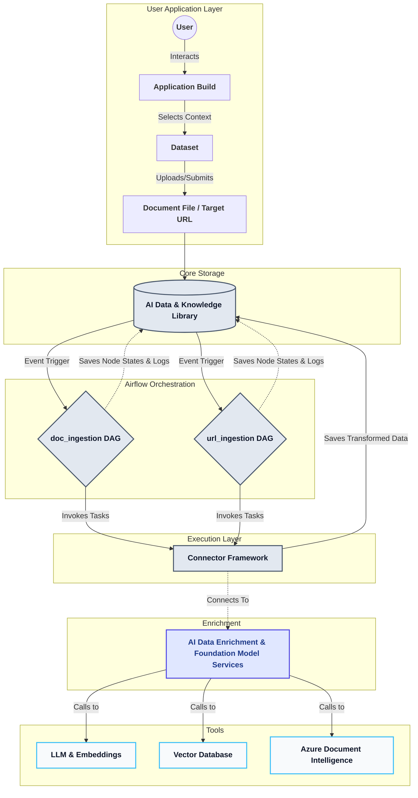

# Ingestion Pipeline & Workflow Orchestration

!!! abstract "Module Overview"
    This layer acts as the operational brain of the ingestion framework. It coordinates data movement end-to-end across both batch and real-time modes. By combining event-driven triggering, precise buffering control, and highly reliable execution semantics (such as automated retries, checkpointing, and historical backfills), it ensures that downstream AI agents and models receive a continuous, unbroken stream of clean data.

## Core Orchestration Engine

All workflow coordination is managed centrally by **Apache Airflow**. Instead of isolated cron jobs or manual scripts, every ingestion pipeline is defined as a Directed Acyclic Graph (DAG) using Python. This approach ensures that tasks connect logically while maintaining strict independence and fault tolerance. 

---

## Execution Semantics & Reliability

To ensure enterprise-grade reliability, the orchestration layer implements several critical execution semantics:

### 1. Job Control & Triggering
Pipelines operate dynamically based on the ingestion mode:

* **Batch Mode:** Workflows execute on a predefined time schedule (e.g., daily warehouse refreshes).

* **Real-Time / Event-Driven:** Workflows are triggered instantly via Airflow Sensors or external API calls when new data arrives.

### 2. Automated Retries
Data pipelines are prone to transient errors such as network blips or temporary API rate limits.

* Airflow is configured to automatically retry failed tasks, executing them from the beginning. 

* The engine utilizes tunable parameters like `retries` and `retry_delay`, often employing exponential backoff to prevent overwhelming downstream systems during an outage.

### 3. State Management & Checkpointing
Because Airflow tasks are stateless, independent units, state tracking is handled externally. 

* Execution status is constantly checkpointed and recorded in [`AI Data & Knowledge Library/System`](../03-ai-data-layer.md)
  
* If a worker node crashes mid-execution, the system knows exactly which tasks succeeded and which need to be restarted.

---

## Buffering & Concurrency Control

When processing massive historical backfills or handling sudden spikes in real-time events, the orchestrator prevents infrastructure strain through strict concurrency limits. 

* **Active Run Limits:** The `max_active_runs` parameter restricts how many DAG runs can execute simultaneously.

* **Task Pools:** Specific resource-intensive connections (like the Azure SQL database connector) are assigned to isolated Airflow pools, ensuring they never exceed connection limits or cause database exhaustion.

## Active DAG Pipelines

The orchestration engine currently relies on two primary data ingestion pipelines, each tailored to specific data formats.

### 1. Document Ingestion Pipeline (`doc_ingestion`)
This complex DAG is responsible for securely pulling, parsing, and transforming uploaded files. It utilizes branching logic to intelligently route data based on extraction success.

* **`get_data_from_queue`**: Picks up the new document processing event triggered by the user upload.
* **`process_document`**: Hands the raw file off to the `doc_processors` (like Docling or Azure Document Intelligence) to extract text and markdown.
* **`check_metadata_extraction` (Branch):** A conditional logic node. It verifies if the processor successfully extracted the required metadata and layout structure.
* **`extract_metadata` & `transform`**: Cleanses the text, chunks the markdown, and prepares the payload for vectorization.
* **`save_to_mongo`**: Commits the final transformed data and structured embeddings to the database layer.

### 2. URL Ingestion Pipeline (`url_ingestion`)
A streamlined, linear DAG designed for fast web scraping and data syncing.

* **`get_url`**: Receives the target URL submitted from the dataset application.
* **`load_data`**: Uses HTTP connectors to scrape the raw HTML or fetch the target payload.
* **`update_mongo`**: Directly updates the existing records in the database with the newly fetched web content.

---

## State Management & Observability

To ensure enterprise-grade reliability, Airflow's internal tracking is deeply integrated with your custom infrastructure. 

Instead of relying solely on Airflow's default backend for monitoring, **all logs and states are saved directly into the `AI Data & Knowledge Library/System`**. Because the status of every single task node is centralized here, the frontend application can seamlessly query the library to show users real-time progress bars or error alerts if an ingestion step (like `extract_metadata`) fails.

## Orchestration Flow & AI Enrichment Diagram

While Apache Airflow handles the *scheduling and coordination* of the pipelines, it does not do the heavy lifting itself. Instead, the DAG nodes actively utilize the **Connector Framework** (detailed in Section 1.1) to execute the extractions. 

When complex processing is required, the connectors securely hand off the payloads to the **AI Data Enrichment & Foundation Model Services** layer. This external layer performs the high-compute tasks—such as OCR, semantic chunking, and LLM inference—before returning the normalized data to the pipeline for final storage.

---

## Sample Screen Shots of Airflow

**Documentation**
[Airflow Documentation](https://airflow.apache.org/docs/apache-airflow/stable/index.html)