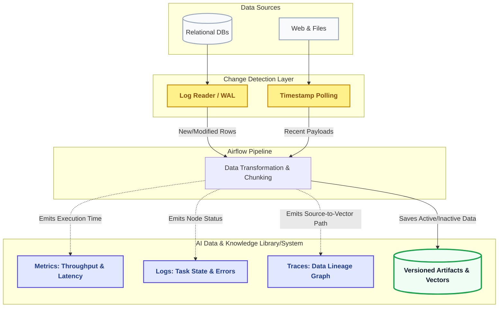

# Sub-Layer 3: Change Detection & Ingestion Telemetry
!!! abstract "Module Overview"
    This layer guarantees data freshness and system observability. It intelligently tracks source-level modifications to prevent duplicate processing, while emitting rich telemetry to provide complete operational visibility—spanning run health, error diagnostics, and end-to-end data lineage.

## Telemetry & Change Detection Flow

---

## Change Detection & Version Control (CDC)

Instead of repeatedly extracting entire tables or re-parsing unchanged documents, the ingestion pipeline utilizes Change Data Capture (CDC) methodologies. CDC identifies and records row-level changes—such as inserts, updates, and deletes—and applies only those modified records to downstream systems. This minimizes compute overhead and ensures downstream AI agents always have the freshest context.

### Detection Strategies
Depending on the data source, the framework applies targeted detection mechanisms to prevent duplicate ingestion:

* **Log-Based CDC (Databases):** For relational databases mapped in your `database/` connectors (like Azure SQL or PostgreSQL), the framework reads the native database transaction logs to capture changes. This is the most efficient approach as it captures all changes, including deletes, with zero impact on application queries.
* **Timestamp Polling (APIs, Web & Documents):** For REST APIs, web scraping, and file storage, the pipeline queries the `updated_at` timestamps or last-modified metadata to fetch only the newly added or modified payloads.

### Versioning & Deletion Handling
When a record or document is deleted at the source, it is captured as a specific change event. To maintain a consistent version history and prevent broken references in the AI's Retrieval-Augmented Generation (RAG) memory, the system employs **soft deletes** (tombstoning). The vector embeddings and metadata stored within the [`AI Data & Knowledge Library/System`](../03-ai-data-layer.md) are marked as inactive rather than hard-deleted, preserving the historical audit trail.

---

## Ingestion Telemetry & Observability

Telemetry is the automated, continuous measurement and transmission of data from systems to a central place for analysis. Because pipelines can fail silently or experience upstream schema drift, this layer emits continuous signals to ensure the data is complete, accurate, and trustworthy.

The pipeline observability relies on three core types of telemetry data, all of which are centralized in your storage layer:

### 1. Metrics (Health & Performance)
Numerical measurements collected over time that reflect the state of the ingestion system. 

* **Run Tracking:** Tracks DAG execution times, task queue lengths, and data volume throughput.

* **Error Rates:** Monitors the frequency of API timeouts or database connection drops to proactively detect system degradation.

### 2. Logs (Error Diagnostics)
Timestamped records of events and errors produced by the software.

* Logs provide the rich context essential for root cause analysis. 

* As established in Sub-Layer 2, the status, logs, and execution states of every single Airflow task node are pushed directly into the [**`AI Data & Knowledge Library/System`**]((../03-ai-data-layer.md)), ensuring centralized, easily searchable error diagnostics.

### 3. Traces & Lineage (Auditability)
A trace represents the journey of data as it moves through the distributed system. Data lineage provides end-to-end transparency.

* **Impact Analysis:** Lineage reveals exactly which downstream datasets or AI models are affected by an upstream issue.

* **Debugging Context:** If a LangChain agent hallucinates or retrieves questionable data, engineers can trace that specific vector back through the pipeline to find the exact source document, extraction timestamp, and transformation node. 

* **Compliance:** This strict tracking ensures the system can demonstrate exactly where sensitive data originated and how it was processed, which is a requirement for enterprise governance.

