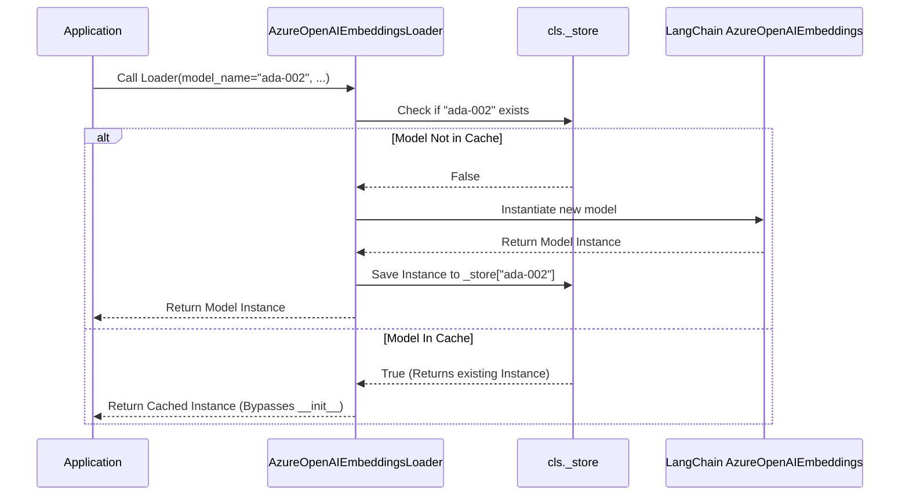

# Azure OpenAI Embeddings (`AzureOpenAIEmbeddingsLoader`)

!!! abstract "Class Overview"
    `AzureOpenAIEmbeddingsLoader` is a specialized factory class that inherits from `EmbeddingsFunction`. It provides a highly optimized wrapper around LangChain's `AzureOpenAIEmbeddings`. By utilizing a class-level caching mechanism, it ensures that identical embedding models are only loaded into memory once across the entire application lifespan.

## Core Architecture: The Factory & Caching Pattern

The most critical feature of this class is its use of the Python `__new__` dunder method. Unlike standard classes that return an instance of themselves, this loader intercepts the creation process to act as a **Singleton-style Factory**.

1. **Cache Check:** When called, `__new__` checks an internal class-level dictionary (`_store`) to see if an instance of the requested `model_name` already exists.
2. **First-Time Load:** If the model is not in the cache, it initializes a brand new LangChain `AzureOpenAIEmbeddings` object, saves it to `_store`, and returns it.
3. **Subsequent Loads:** If the model is already in the cache, it bypasses initialization entirely and returns the existing LangChain model object.

!!! warning "Python Object Returns"
    Because `__new__` explicitly returns an instance of `AzureOpenAIEmbeddings` (and not `AzureOpenAIEmbeddingsLoader`), the `__init__` method of this loader class is effectively bypassed. You are receiving the raw, configured LangChain object ready for immediate use in vector stores or RAG pipelines.

---

## Initialization Parameters

When calling the loader, you must provide the necessary Azure connection details. 

| Parameter | Type | Description |
| :--- | :--- | :--- |
| `model_name` | `str` | The specific name of the embedding model (e.g., `text-embedding-ada-002`). This acts as the unique cache key. |
| `api_key` | `str` | Your secure Azure OpenAI API key. |
| `base_url` | `str` | The base endpoint URL for your Azure OpenAI resource. |
| `api_version` | `str` | The API version to target (e.g., `2023-05-15`). |
| `deployment_name` | `str` | The custom deployment name you assigned to the model in Azure AI Studio. |

---

## Caching Flow Diagram

